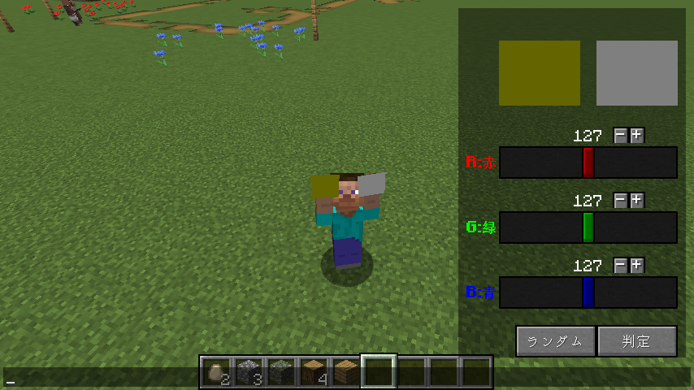
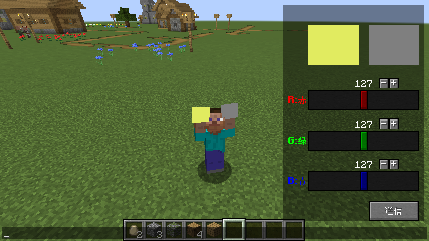

# Color Quiz Mod 1.16.5
- マイクラ内で色覚ゲームができるmod
- クライアント単体でも遊べます
- チャットを開くと右下にUIが表示されます
- プレイヤーの持つ色はサーバーコマンドなしでは、クライアント限定


## クライアントでの遊び方
- 右下の"ランダム"を押すと問題が変わる
- 判定ボタンで正解・不正解がわかる

## サーバーでの遊び方
- サーバー全員で共通の問題を解いて表示可能
### コマンド
コマンドはマルチで共通の問題を解くときのみ

テストの開始
- 色はランダム
```
/colortest test random
```
- 色を指定するとき(値はint型)
```
/colortest test color <Red> <Green> <Blue>
```
サーバーでのテストの時は一度のみ"送信ボタン"が表示される。


- 各々の持つ2枚の色がサーバー全体で共有されるためのコマンド
```
/colortest visualize
```
- Playersの回答結果を取得
- これを実行すると"result"のスコアボードに記述される
```
/colortest getcolor <Players>
```
- これを実行すると全員に自身の回答結果がフィードバックされる
```
/colortest feedback <Players>
```
